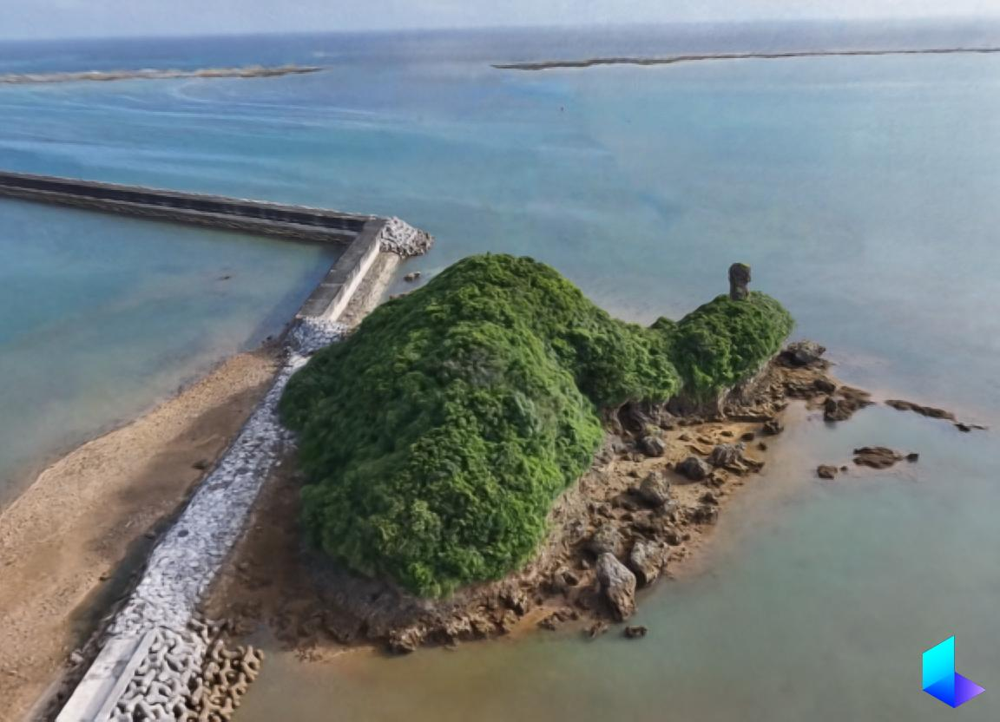
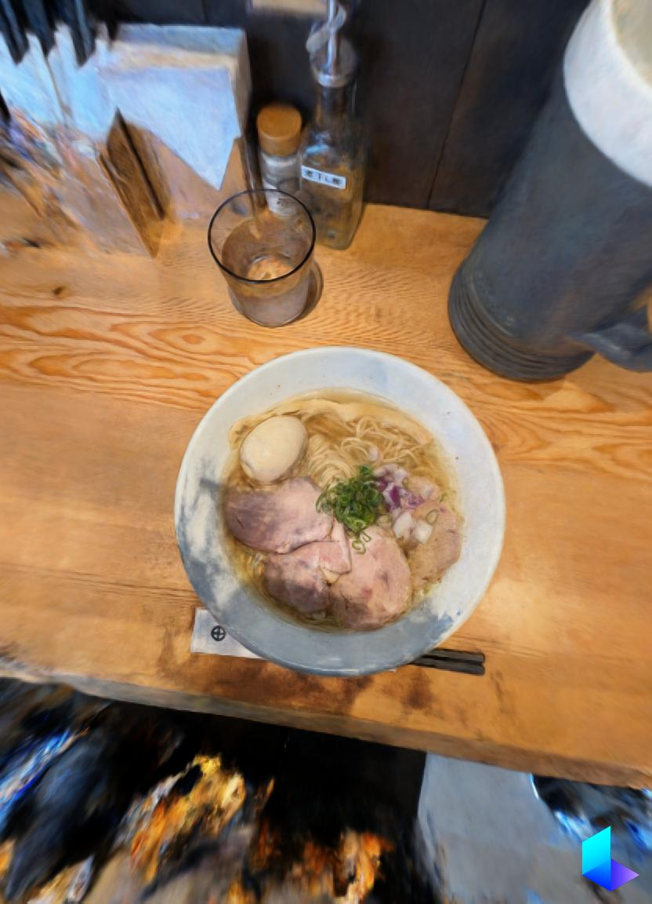
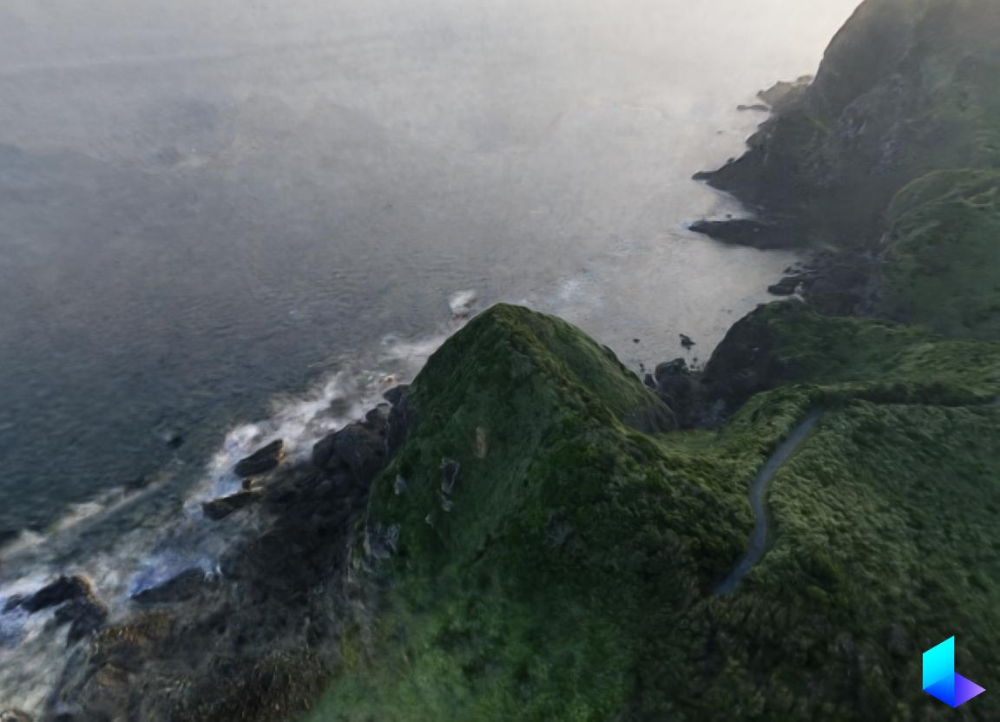

<h1 align="center">yozzzo</h1>

<b>Full-Stack Engineer</b> — backend to browser, and sometimes into 3D.

  
  
  
  
  

  
  
  

---

### Projects

**[gaussian-splatting-3d-viewer](https://github.com/yozzzo/gaussian-splatting-3d-viewer)** — 3D Gaussian Splatting web app with real-time progress tracking `Python`

**[zendesk-mcp-server](https://github.com/yozzzo/zendesk-mcp-server)** — Zendesk MCP server for Claude Desktop / Claude Code `JavaScript`

**[forge-splat-viewer](https://github.com/yozzzo/forge-splat-viewer)** — Gaussian Splatting viewer built on forge-gfx `Rust` `WebGPU`

**[residue](https://github.com/yozzzo/residue)** — Game project in Godot Engine `GDScript`

**[ohaka](https://github.com/yozzzo/ohaka_web)** — Full-stack web app (web / api / infra) `TypeScript`

---

### 3D Gallery

*Click to view interactive 3D — powered by [Luma AI](https://lumalabs.ai)*

  &nbsp;
  &nbsp;
  &nbsp;
  

---

### Drone Footage

*Coming soon*

| | | |
|:---:|:---:|:---:|
| `▶ Video 1` | `▶ Video 2` | `▶ Video 3` |

<!-- Replace with YouTube thumbnails:

-->
